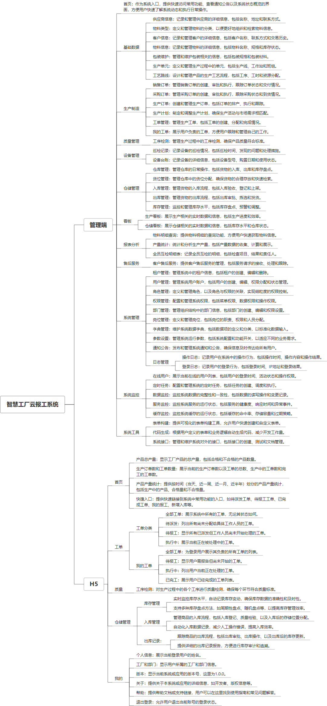

 

    
 

公司拥有上百套具有自主知识产权的软件系统，详情请查看码云首页或公司官网

 
<h1>云报工系统</h1>

<a href="https://www.haishi.net.cn/">公司官网</a> ｜ <a href="https://www.haishi.net.cn/">在线体验</a>

 

## 系统介绍

云报工系统是一款面向制造企业的云端生产管理系统，它整合了用户管理、角色权限、部门岗位、物料信息、工单管理、生产计划、工序检测、库存控制等多个功能模块，支持从销售订单接收、生产计划制定、工单下达、物料准备、工序执行、质量检测、到成品入库的全流程管理，同时提供数据监控、服务监控、缓存监控等系统运行保障工具，旨在提高生产效率，降低成本，实现生产过程的数字化和智能化。

云报工系统是一款面向制造企业的云端生产管理系统，它整合了用户管理、角色权限、部门岗位、物料信息、工单管理、生产计划、工序检测、库存控制等多个功能模块，支持从销售订单接收、生产计划制定、工单下达、物料准备、工序执行、质量检测、到成品入库的全流程管理，同时提供数据监控、服务监控、缓存监控等系统运行保障工具，旨在提高生产效率，降低成本，实现生产过程的数字化和智能化。
本项目名称为智慧工厂云报工系统，是一款面向制造企业的生产管理软件。该系统旨在通过信息化手段，实现生产过程的实时监控、数据采集和分析，帮助企业提高生产效率、降低成本、提升产品质量。
本系统主要功能模块包括：
- 基础数据：管理供应商、客户、物料、工序、包装等基础信息。
- 生产制造：处理销售订单、采购订单、生产订单，制定生产计划，进行工单管理。
- 质量管理：对生产过程进行质量检测，确保产品质量。
- 设备管理：进行设备巡检记录，管理设备台账。
- 仓储管理：管理仓库、货位、入库、出库和库存。
- 看板：提供生产看板和仓储看板，实时展示生产和库存情况。
- 报表分析：提供物料明细查询、产量统计、全员互检明细表等报表分析功能。
- 售后服务：提供客户售后服务管理。
- 系统管理：进行用户管理、角色管理、权限管理和部门管理。
本系统从用户层面可以分为以下几个端：
- 管理端：企业管理人员使用，可以进行系统配置、数据分析、报表查看等操作。
- 生产人员端：生产线上的操作人员使用，可以进行工序报工、质量检测数据录入等操作。
- 仓库人员端：仓库管理人员使用，可以进行入库、出库、库存盘点等操作。
- 质量人员端：质量管理人员使用，可以进行质量检测结果录入、质量问题跟踪等操作。
- 设备人员端：设备管理人员使用，可以进行设备巡检记录、设备维修保养记录等操作。
                

## 系统功能介绍

### 系统包含终端说明

管理端（WEB）、用户端（H5）

| 序号 | 模块               | 模块说明 |
| ---- | ------------------ | -------- |
| 1    | GC-ZHGC-YBG-SERVER | 服务端   |
| 2    | GC-ZHGC-YBG-MANAGE | 管理端   |
| 3    | GC-ZHGC-YBG-H5     | H5端     |

### 系统功能结构

### 系统功能说明

- 生产制造：该模块是系统的核心功能，涵盖了从销售订单到生产计划，再到工单管理的全流程。
- 质量管理：该模块对于保证产品质量至关重要，通过工序检测等功能，可以及时发现和解决生产过程中的质量问题。
- 设备管理：设备是生产的重要资源，该模块可以帮助企业做好设备的维护保养工作，保障生产的顺利进行。
- 仓储管理：该模块可以帮助企业实现仓库的精细化管理，提高库存周转率，降低库存成本。
- 看板：看板功能可以将生产和库存的关键数据可视化，方便管理人员实时掌握生产经营情况。

## 系统主要界面

## 系统技术说明

### 代码模块说明

| 序号 | 目录                            | 目录说明 |
| ---- | ------------------------------- | -------- |
| 1    | GC-ZHGC-YBG-SERVER/px-tenant    | --       |
| 2    | GC-ZHGC-YBG-SERVER/px-framework | --       |
| 3    | GC-ZHGC-YBG-SERVER/px-common    | --       |
| 4    | GC-ZHGC-YBG-SERVER/px-system    | --       |
| 5    | GC-ZHGC-YBG-SERVER/px-generator | --       |
| 6    | GC-ZHGC-YBG-SERVER/px-admin     | --       |
| 7    | GC-ZHGC-YBG-SERVER/px-quartz    | --       |

### 系统技术选型

#### 开发语言/框架

JAVA（JDK1.8）
前端框架：VUE2

#### 服务中间件

Nginx
Tomcat

#### 数据库

MySQL（5.7+）

#### 其他说明

无

## 系统演示/商用

请扫码添加客服微信获取演示地址和系统详细资料。

如果您想基于云报工系统进行商业化交付或定制开发服务，我们提供有偿的技术服务支持，合作模式不限，欢迎沟通！

公司官网地址： <a href="https://www.haishi.net.cn/">https://www.haishi.net.cn</a>

联系客服获取专业回答。

## 使用须知

1、 本项目商用必须获得版权所有者的授权。

2、 未经允许本项目代码不允许二次出售。

